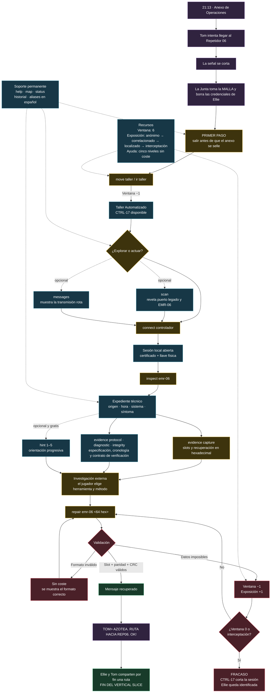
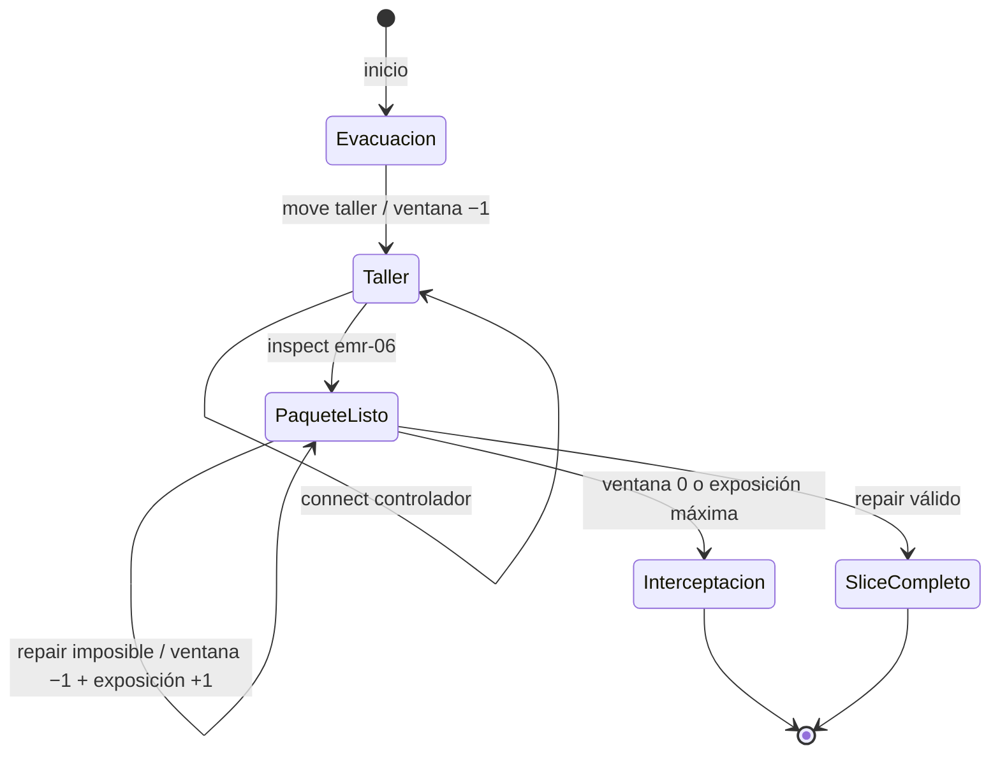
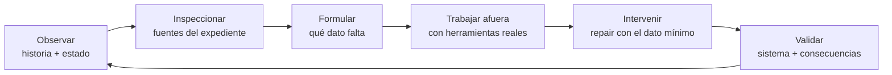

# MALLA: BEFORE THE SILENCE — mapa del vertical slice

Este documento describe lo que existe hoy en la primera parte del juego. Es un
mapa de diseño con spoilers: conecta historia, acciones, estados, recursos,
ayudas, fracaso y recompensa narrativa.

## Flujo integral

## Estados del juego

## Capas de la experiencia

| Momento | Historia | Acción del jugador | Mecánica enseñada | Cambio de estado |
|---|---|---|---|---|
| Apertura | Una discusión mínima establece el acuerdo del Repetidor 06; la señal cae y la Junta toma la MALLA | Leer y reconocer la urgencia | Objetivo y comando sugerido | Ninguno |
| Evacuación | El anexo comienza a sellarse | `move taller` | Movimiento y coste temporal | Ventana 6 → 5 |
| Investigación | Sobrevive un controlador anterior al golpe; Ellie reconoce el transmisor que reparó con Tom | `scan`, `messages`, `connect` | Descubrimiento y acceso local | Sesión CTRL-17 abierta |
| Investigación | La transmisión está incompleta y el canal de retorno permanece vacío | `inspect`, cuatro fuentes `evidence` | Contrastar captura, protocolo, diagnóstico e integridad | Expediente abierto |
| Resolución | Recuperar una voz dentro del ruido | Elegir una herramienta externa y producir los dos slots perdidos | Álgebra GF(2⁸); cinco pistas opcionales | Sin coste dentro del juego |
| Verificación | CTRL-17 evalúa una escritura real | `repair emr-06 <64 hex>` | Formato, síndromes P/Q, CRC y riesgo de escritura | Éxito o mayor exposición |
| Recompensa | Tom sigue vivo; Ellie responde, pero él no puede oírla | Leer el mensaje recuperado | Payoff narrativo y ruta compartida | Slice completo |

## Inventario de mecánicas implementadas

| Sistema | Elementos actuales | Función | Coste o consecuencia |
|---|---|---|---|
| Presentación | Web responsive con barra de estado, mapa, feed narrativo, expediente y controles contextuales; columnas en escritorio y composición apilada en móvil | Separar investigación y relato sin que una consulta técnica oculte a Tom | Ninguno; operable con teclado y sin depender del color |
| Escenas | Hora y lugar, diálogo separado, etiquetas `ANTES`, `AHORA`, `CONFIRMADO` y `SIN RESPUESTA`; último hito narrativo persistente | Dar jerarquía a la historia y distinguir hechos, inferencias y silencios | Los hitos técnicos relevantes actualizan la derecha; las consultas comunes no |
| Navegación | Dos ubicaciones: Anexo y Taller; `scan`, `map`, `move` | Enseñar espacio y desplazamiento | Moverse al Taller consume 1 ventana |
| Sesión local | CTRL-17; `connect`, `disconnect` | Abrir o cerrar acceso al controlador heredado | Sin coste actual; impide moverse mientras está abierta |
| Inteligencia | `messages`, `status`, mapa de Ellie y última señal de Tom | Entregar contexto narrativo y operativo | Sin coste |
| Expediente | `inspect emr-06`; captura, protocolo, diagnóstico e integridad mediante `evidence` | Presentar fuentes operativas sin formular el método | Requiere sesión local; sin coste |
| Incidente | Dos erasures entre doce slots binarios de 16 bytes, síndromes RAID-6 P/Q y CRC-32 | Exigir código o álgebra sistemática en GF(2⁸) con una herramienta externa elegida por el jugador | Una reparación imposible consume ventana y eleva exposición |
| Asistencia | `hint <1-5>`; desde priorización hasta desbloqueo total | Evitar bloqueos sin convertir documentación en pseudocódigo | Gratuita; no altera estado ni recursos |
| Presión | Ventana y exposición | Convertir errores plausibles y espera en riesgo narrativo | Ventana 0 o interceptación terminan la partida |
| Control | `wait`, `quit`, comandos abreviados y aliases en español | Dar libertad y reducir fricción de entrada | `wait` consume ventana; `quit` termina la sesión |

### Alcance exacto del prototipo

- 2 ubicaciones: Anexo de Operaciones y Taller Automatizado.
- 1 sistema conectable: CTRL-17.
- 1 captura: EMR-06.
- 1 incidente técnico: reconstrucción de dos erasures P/Q con comprobación CRC-32.
- 4 fuentes de evidencia y 5 niveles de pistas gratuitas.
- 1 desenlace exitoso y 1 condición general de interceptación.

## Ciclo jugable actual

## Lo que funciona bien

- La ficción y la mecánica central hablan de lo mismo: una comunicación rota se
  recupera reconstruyendo datos rotos.
- La complejidad escala con orden: movimiento → conexión → fuentes → diagnóstico →
  validación.
- Los errores de formato son gratuitos; el jugador puede aprender la interfaz
  sin recibir un castigo arbitrario.
- Captura, protocolo, diagnóstico e integridad explican el incidente desde
  ángulos distintos sin entregar pseudocódigo ni elegir una herramienta.
- Las cinco pistas permiten regular la ayuda desde una observación hasta el
  desbloqueo total, sin castigar a quien las consulta.
- La historia avanza en escenas ligadas a descubrimientos concretos; abrir una
  especificación no borra el último momento entre Ellie, Tom y la ciudad.
- El éxito entrega información emocional y operativa al mismo tiempo: Tom está
  vivo y aparece la ruta hacia el siguiente objetivo.

## Puntos que conviene analizar

1. **La evacuación es tutorial, no reto.** Sólo existe una ruta válida. Si
   queremos una decisión jugable desde el inicio, `scan` podría revelar una ruta
   rápida pero expuesta y otra lenta pero segura.
2. **La presión temporal casi no afecta al camino correcto.** Se inicia con seis
   unidades y la ruta obligatoria consume una. El resto sólo baja al esperar o
   enviar datos posibles pero incorrectos.
3. **La exposición es más ficción que sistema durante este slice.** Sólo aumenta
   con un `repair` incorrecto bien formado; escanear, conectarse e inspeccionar no
   dejan huella.
4. **El checksum no es un segundo acertijo.** El expediente entrega el CRC
   autenticado y el controlador lo verifica; el jugador no tiene que repetirlo.
5. **La semilla modifica y reproduce el reto.** Cambia los bloques, ambos índices
   perdidos, P/Q y CRC, pero una misma semilla conserva exactamente la instancia.
6. **La densidad de evidencia todavía necesita playtest.** Cuatro fuentes pueden
   sostener una investigación o producir ruido; hay que medir qué consulta y qué
   entiende cada jugador antes de calcular.
7. **La herramienta externa ya es una decisión de identidad.** El juego no
   incluye bloc, calculadora, editor ni intérprete. La prueba pendiente es hacer
   que copiar datos hacia herramientas reales resulte cómodo.

## Decisiones recomendadas para la siguiente iteración

Prioridad sugerida:

1. Decidir si la apertura seguirá siendo un tutorial lineal o tendrá una primera
   elección con consecuencias.
2. Hacer que la semilla cambie los bloques, el índice perdido y el checksum.
3. Definir con precisión qué acciones consumen ventana o elevan exposición.
4. Probar si los jugadores pueden formular el diagnóstico a partir de las
   fuentes antes de abrir una pista técnica.
5. Evaluar exportaciones estándar como JSON o una captura binaria para usar
   herramientas reales sin depender de transcripción manual.
6. Añadir una decisión corta después del mensaje de Tom para que el slice cierre
   con agencia, no sólo con una revelación.
