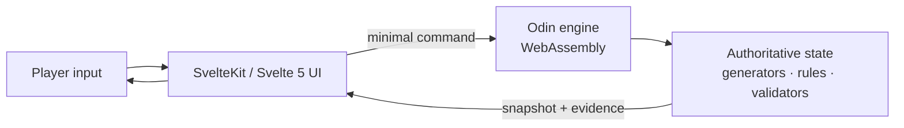

<p align="center">
  
</p>

<p align="center">
  <strong>A political cyberpunk thriller about infrastructure, uncertainty, and two people trying to find each other before a city goes silent.</strong>
</p>

<p align="center">
  <a href="https://malla-before-the-silence.pages.dev/"><strong>Play the live build</strong></a>
  ·
  <a href="#the-technical-incidents">Explore the challenges</a>
  ·
  <a href="#running-locally">Run it locally</a>
</p>

---

## About the game

**MALLA: Before the Silence** is a 40–60 minute browser game presented through
the field terminal of Ellie, a maintenance engineer for a distributed civic
network.

For weeks, a popular uprising has occupied the streets. Tonight, a military and
corporate alliance seizes the city's central identity systems, gateways, and
broadcasters. The new junta turns public infrastructure into checkpoints and
surveillance. Ellie has one immediate objective: cross the city and reach Tom,
her partner, at an old analog repeater before communications disappear.

There is no combat, supernatural threat, or omnipotent hacking. Ellie has
limited credentials, incomplete topology, and physical access only to the node
in front of her. The tension comes from ordinary systems—transport, radio,
identity, and logistics—being repurposed as instruments of control.

## What the player does

The game combines a linear narrative journey with four engineering incidents.
For each incident, the player:

1. reaches and opens a local infrastructure node;
2. gathers captures, logs, policies, and integrity records;
3. identifies the underlying systems problem;
4. solves it with code, mathematics, or careful manual analysis; and
5. submits the smallest operational intervention the node can verify.

Evidence can be copied or downloaded for analysis in any external tool. The
game never executes player-written code. Five progressive hint levels keep the
story accessible; the last one offers an explicit unlock for players who would
rather continue the narrative.

## The technical incidents

> This section describes the structure of the challenges without publishing
> seed-specific answers.

| Act | Incident | Core problem |
| --- | --- | --- |
| I — The Lost Signal | **EMR-06 packet repair** | Recover two erased 16-byte data blocks from RAID-6 P/Q syndromes over GF(2⁸), then satisfy the complete record's CRC-32. |
| II — The Closing City | **CR-02 robust routing** | Find a path through a directed graph whose travel times are intervals, while guaranteeing that no possible arrival overlaps a closure window. |
| III — The Service Corridor | **CAP-03 survivable flow** | Allocate independent primary and backup flows that meet demand, respect residual capacity and protected headroom, minimize cost, and survive any single-link failure. |
| IV — The Last Carrier | **BCN-R6 soft decoding** | Combine nine corrupted radio frames using RSSI-derived bit reliability, enforce a decision margin, and recover a frame that passes CRC-16/CCITT-FALSE. |
| V — HUSH | **Narrative resolution** | The technical interface falls away. The final act is about crossing the last streets, leaving network coverage, and reaching the other person. |

### Why these are not arbitrary puzzles

Every algorithm changes Ellie's physical situation. Packet recovery reveals
Tom's route. Robust optimization gets her through a city whose checkpoints are
still moving. Disjoint flow opens a channel without sacrificing civil
reservations. Soft-decision decoding extracts a final carrier from a failing
radio link.

Instances are generated from a deterministic 64-bit seed. The erased packet
slots, urban graph, capacity network, and corrupted radio frames all change
together while remaining solvable and internally verifiable.

## Architecture

The distribution is a static site, but the browser UI is not the authority.
Game rules and incident validation live in Odin and run as WebAssembly.



Svelte renders the story, maps, evidence, hints, controls, and responsive HUD.
It sends commands to the WebAssembly boundary and renders the returned
snapshot. It never independently decides whether a solution is valid. This
keeps progression deterministic and puts browser interactions and tests against
the same engine used by the shipped game.

### Stack

- **SvelteKit, Svelte 5, and TypeScript** for the interface and content layer
- **Odin** for deterministic generation, state transitions, reference solvers,
  and authoritative validation
- **WebAssembly** as the small boundary between the engine and the browser
- **Vite and Vitest** for builds and web-level unit/integration tests
- **Nix** for a reproducible Odin/Node/pnpm toolchain and release artifact
- **Wrangler and Cloudflare Pages** for static deployment

## Running locally

### Reproducible build with Nix

From the repository root:

```sh
nix run path:.
```

Open <http://127.0.0.1:4173>.

### Development server

```sh
nix develop path:.
cd web
pnpm install
pnpm run dev
```

The development command first compiles the Odin engine to
`web/static/game.wasm`, then starts Vite with hot reload.

To replay a deterministic instance, append a 64-bit unsigned seed:

```text
http://localhost:5173/?seed=1999
```

## Quality gates

Run the complete project validation from `web/`:

```sh
pnpm run validate
```

The gate runs:

- Svelte and TypeScript diagnostics;
- ESLint and Prettier;
- the Odin engine test suite;
- web unit tests and browser-to-WASM integration tests; and
- a fresh static production build.

For the fully reproducible package:

```sh
nix flake check path:.
nix build path:.
```

The Nix artifact is written to
`result/share/malla-before-the-silence-web/`.

## Deploying to Cloudflare Pages

The checked-in Wrangler configuration targets the
`malla-before-the-silence` Pages project and publishes `web/build`.

```sh
cd web
pnpm install
pnpm exec wrangler login
pnpm run deploy:pages
```

The site requires no application server or database. Gameplay state and
evidence stay in the browser, and a refresh starts a new deterministic session.

## Repository map

```text
.
├── src/
│   ├── algorithms.odin   # GF arithmetic, CRCs, graph and flow primitives
│   ├── operation.odin    # Incident generation, solvers, and validators
│   ├── game.odin         # Authoritative game state
│   ├── command.odin      # Player-command state transitions
│   ├── evidence.odin     # Evidence exposed to the interface
│   └── web.odin          # Minimal JavaScript/WebAssembly boundary
├── web/
│   ├── src/lib/game/     # Browser adapter, presentation models, and tests
│   ├── src/lib/components/
│   ├── src/routes/       # SvelteKit experience
│   ├── static/           # Headers, robots.txt, and generated game.wasm
│   └── wrangler.jsonc    # Cloudflare Pages configuration
├── scripts/              # WebAssembly build entrypoint
├── flake.nix             # Reproducible development and release package
└── DIAGRAMA_ACTO_I.md    # Detailed Act I design diagram
```

## Design principles

- **The relationship comes first.** Every system either brings Ellie and Tom
  closer or makes their separation more dangerous.
- **The network is the setting.** Energy, transit, radio, logistics, and
  surveillance form one urban organism.
- **Algorithms are actions.** Each technical task has an operational and
  narrative reason to exist.
- **Control is institutional.** Lists, curfews, correlation, and silence turn
  ordinary infrastructure into a system of coercion.
- **Accessibility is part of the interface.** The UI supports keyboard use,
  responsive layouts, reduced motion, text scaling, explicit status text, and
  progressive hints.

## Project status

The current build is a complete five-act prototype with a playable ending. It
is designed for modern desktop and mobile browsers and ships as HTML, CSS,
JavaScript, and a single Odin WebAssembly engine.

Detailed Act I design notes are available in
[`DIAGRAMA_ACTO_I.md`](DIAGRAMA_ACTO_I.md).
